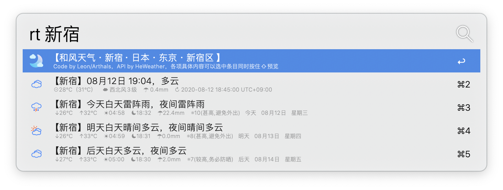
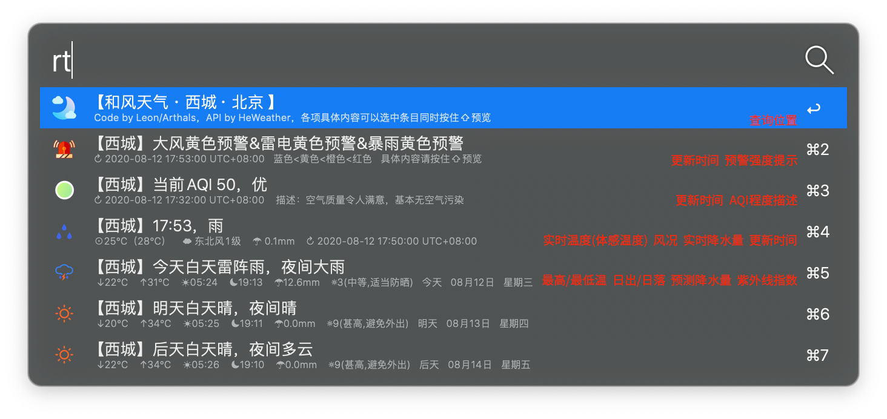

        

## Author

作者主页：[zhuozhiyongde(Arthals)](https://github.com/zhuozhiyongde/)

项目地址：[Alfred_HeWeather_Workflow](https://github.com/zhuozhiyongde/Alfred_HeWeather_Workflow)

源码作者主页：[skefy(Leon)](https://github.com/skefy/)

源码项目地址：[alfred_workflow_weather](https://github.com/skefy/alfred_workflow_weather)

## 功能说明

查询灾害预警、空气质量指数（AQI）、实况天气、未来三天的预测天气
本Alfred Workflow使用和风天气（ https://dev.heweather.com/ ）API，仅供教育于参考之用，不得用于商业用途。

本Alfred Workflow源码来自@skefy(Leon)/[alfred_workflow_weather](https://github.com/skefy/alfred_workflow_weather)

因为原作者初始设置base_url为商业版API，个人使用需修改源代码，较为不便，且和风天气API已经更新至v7，而原作者并未同步更新，所以我以源码为基础，对于原项目进行了90%以上的重构。

除了上述变更之外，我还进行了如下修改：

* 新增**灾害预警**查询，当有多条灾害预警时，自动返回去重后合并的并列字符串

* 新增**AQI**查询

* 修改了条目布局，为各个条目新增了更多的信息，如日出日落、降水量、体感温度，且仿照@jason0x43/[alfred-weather](https://github.com/jason0x43/alfred-weather)的布局，引入了unicode图标，更为简洁和直观。

* 在环境变量中增添了adm和location参数，精准的定位城市以获得城市ID，同时也是因为原有自动定位的的接口已经过时，且请求auto_ip的话无法精确定位到区县一级，**故舍弃了自动定位功能**。

* 你仍然可以通过`关键词+空格+其他城市名`来**获取其他城市的天气状况**，如果所查询城市不在中国境内，不会返回灾害预警和AQI信息。

* 考虑到大多数人使用的是个人版/开发者版API，我将base_url里的`api`变更为了`devapi`。

* 增添了报错提示，根据最新版的v7API返回的状态码自动提示报错内容。

* 变更了原有图标为和风天气新版icon，更加美观。

  > 有关此项，你可以从[@heweather](https://github.com/heweather) / **[WeatherIcon](https://github.com/heweather/WeatherIcon)** 下载和风天气设计的其他版本icon并且自行替换./res/icon-heweather文件夹中的图标

* 对于返回结果加入了`quicklookurl`参数，对于每项结果，你都可以在选中结果的同时按住`⇧`或者`⌘`+`Y`预览API返回的`fxLink`自适应网页来获取更为详尽的信息。

* 增添了`date_valid()`函数以比较接口获得的三日预报和当日日期，原因是我写代码写到5点的时候偶然发现该接口尚未更新数据，导致11号早上5点请求返回得到了10~12号的信息，而原作者并未对此进行纠正，会自动从今日开始显示为11~13号的信息。

#### **默认keyword**： rt

#### **必要参数**：

* `api_key`：你的WEB API key，普通用户每日前1000次请求免费，开发者版本前16700次请求免费，如有更多需求，请选购商业版或高性能版API，根据需求更换main.py第65行base_url中的`devapi`为`api`。

  > 开发者版本API可以获得未来24h的逐小时预测，但是由于我自己尚未认证，该部分的开发暂时搁置。

* `adm`：所选区县的上级省市范围，用于防止重名城市，如北京市朝阳区和辽宁省朝阳市.

* `location`：请选择具体地区的区县一级规划，如海淀区/汉阳县。

## 使用说明

1. 确保拥有Alfred的Powerpack功能

2. 安装该 workflow

3. [和风天气](https://dev.heweather.com/docs/getting-started/) 注册，申请api_key

4. 注册流程：

   > a. 前往[和风天气](https://dev.heweather.com/docs/getting-started/)进行账号注册
   >
   > b. 注册完毕后，前往[控制台](https://console.heweather.com/#/console) →应用管理→创建应用→免费开发版→随意填写一个应用名称→选择Key类型为WEB API→跟随提示完成注册
   >
   > c. 你的API Key可以在控制台-应用管理处看到了

5. 设置 `api_key`环境参数

   > 建议先到某个地方复制一遍，检查是否带着制表符/回车符复制进去了，这样的话会报错。

6. 设置 `adm`, `location`环境参数，可以以中文输入
> 
>
> 

## 效果预览

***

详细说明：

## License

本项目以[GNU General Public License v3.0](https://github.com/zhuozhiyongde/Alfred_HeWeather_Workflow/blob/master/LICENSE)开源

城市查询、空气查询、实况天气、预测天气API 均来自和风天气®

和风天气®是和风天气公司的注册商标。

天气icon来自[@heweather](https://github.com/heweather)/**[WeatherIcon](https://github.com/heweather/WeatherIcon)** by 和风天气

预警icon来自Freepik from [www.flaticon.com](https://www.flaticon.com/free-icon/siren_3269260?term=warning&page=3&position=45#)

